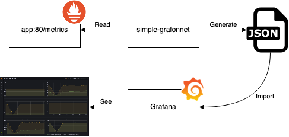
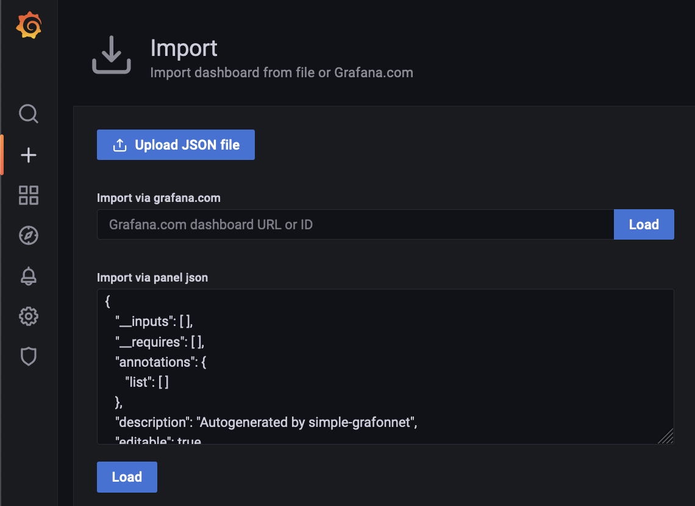
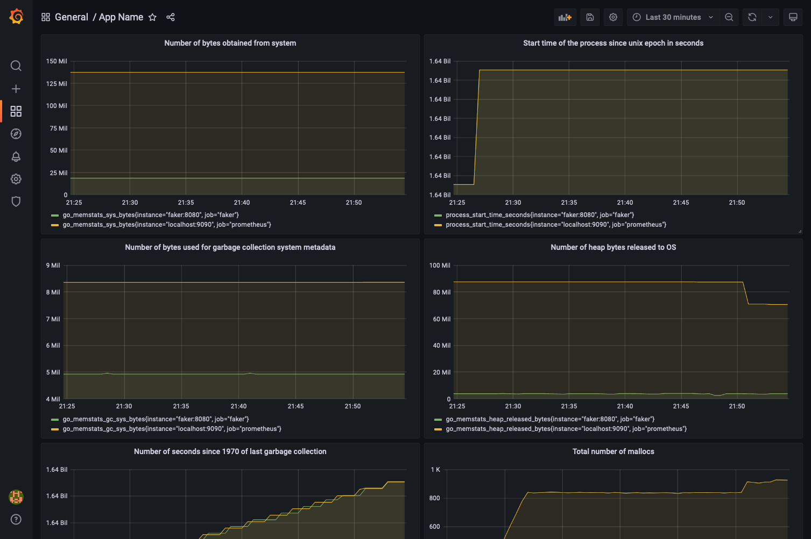

# Simple-Grafonnet - generate simple Grafana dashboard based on app /metrics endpoint



If an application exposes many metrics, it takes much time to create Grafana dashboard.
In simple case, we just need graph for each exposed metric.

This tool:

- Reads Prometheus-like metrics exposed by application endpoint.
- Generates 2-column Dashboard.
- Creates graph for each exposed metric.
- Supports following [metric types](https://prometheus.io/docs/concepts/metric_types/):
  - Gauge - exposed as is
  - Counter - exposed as [`rate()`](https://prometheus.io/docs/prometheus/latest/querying/functions/#rate)
  - Histogram - exposed as [`histogram_quantile()`](https://prometheus.io/docs/prometheus/latest/querying/functions/#histogram_quantile)
  - Summary - exposed as `rate(sum[5m]) / rate(count[5m])`

## Install

```shell
# go install github.com/nanorobocop/simple-grafonnet
```

## Run

1. Print out dashboard JSON on stdout:

   ```shell
   # simple-grafonnet -url http://localhost:8080/metrics
   ```

   Or copy generated dashboard to clipboard:

   ```shell
   # simple-grafonnet -url http://localhost:8080/metrics | pbcopy
   2021/11/25 21:40:17.239 INFO  {simple-grafonnet/main.go:30 main.main} Downloading metrics from endpoint: http://localhost:8080/metrics
   2021/11/25 21:40:17.253 INFO  {simple-grafonnet/main.go:37 main.main} Parsing metrics data
   2021/11/25 21:40:17.253 INFO  {simple-grafonnet/main.go:171 main.(*App).printMetricsStat} Found metrics of type counter: 7
   2021/11/25 21:40:17.253 INFO  {simple-grafonnet/main.go:171 main.(*App).printMetricsStat} Found metrics of type gauge: 31
   2021/11/25 21:40:17.253 INFO  {simple-grafonnet/main.go:171 main.(*App).printMetricsStat} Found metrics of type summary: 1
   2021/11/25 21:40:17.253 INFO  {simple-grafonnet/main.go:171 main.(*App).printMetricsStat} Found metrics of type untyped: 0
   2021/11/25 21:40:17.253 INFO  {simple-grafonnet/main.go:171 main.(*App).printMetricsStat} Found metrics of type histogram: 2
   2021/11/25 21:40:17.253 INFO  {simple-grafonnet/main.go:55 main.main} Generating dashboard
   2021/11/25 21:40:17.291 INFO  {simple-grafonnet/main.go:72 main.main} Dashboard generated and printed to stdout!
   ```

2. Import generated dashboard to Grafana:

   

3. Check result. Tune and save if needed.

   
